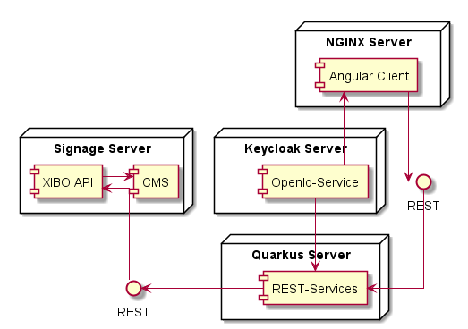
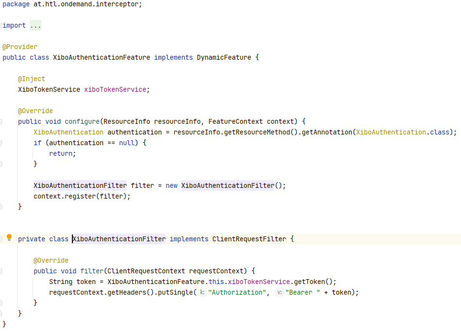

= Backend Documentation
Daniel Andricic Benjamin Ecker
1.0.0, 2020-10-08: Some notes
//:toc-placement!:  // prevents the generation of the doc at this position, so it can be printed afterwards
:sourcedir: ../src/main/java
:icons: font
:sectnums:    // Nummerierung der Überschriften / section numbering
:toc: left

//Need this blank line after ifdef, don't know why...
ifdef::backend-html5[]

// https://fontawesome.com/v4.7.0/icons/
endif::backend-html5[]

== Backend Xibo

==== Kurzer Überblick



Der Quarkus Server ist der Hauptknotenpunkt der die ganze Kommunikation zwischen der
Frontend und dem Xibo-Server ermöglicht.
Die Kommunikation erfolgt durch HTTP-Requests.
In den HTTP-Request und -Response befinden sich die nötigen Daten wie beispielsweise
die ID des Displays und des Videos oder ob beim Response ob die Aktion erfolgreich war oder nicht.
Ebenso kann man überprüfen ob gerade ein Video abgespielt wird.

Die Xibo API und die CMS sind beide in einem Docker-Container, da Sie beide für den Xibo-Server
zuständig sind.


== Config (application.properties)

In der application.properties stehen alle nötigen Konstanten, die für die Kommunikation entscheidend sind.
Beispielsweise die Xibo-URL deutet auf die Adresse vom Xibo-Server.

....
# Global config
quarkus.http.cors=true
quarkus.http.host=0.0.0.0
quarkus.http.root-path=/api

# On demand configuration
on-demand.media-tag=on-demand
on-demand.display-tag=on-demand-display
on-demand.priority=10
on-demand.api-url=http://localhost:8080/api

# Xibo application configuration
on-demand.xibo.url=http://localhost
on-demand.xibo.client-id=ID hier eingeben
on-demand.xibo.client-secret=Secret-Key hier eingeben

# Restclient Configuration
at.htl.ondemand.service.XiboRestClient/mp-rest/url=${on-demand.xibo.url}/api/
at.htl.ondemand.service.XiboRestClient/mp-rest/scope=javax.inject.Singleton

# Include on-demand.html when building with graalvm
quarkus.native.resources.includes=on-demand.html
....

==== Tags

Hier kann man auch die Tags für alle medias und Displays setzen.
Somit werden nur Inhalte angezeigt, die diesen Tag haben.
Wenn kein Tag angegeben wird, dann werden alle medias und displays mit einem Tag zurückgegeben.
Sie müssen nicht den gleichen Tag haben!

==== Priorität

Die Priorität eines Layouts bestimmt, ob es ein anderes Layout überlappen darf oder nicht. +
Es trifft aber meistens nur zu, wenn mehrere Overlay-Layouts aktiv sind. +

==== API-URL

Die API-URL gibt an, an welcher Adresse das backend erreichbar ist. +
In unseren Fall ist das *http://localhost:8080/api*. +
Da die backend und Xibo auf demselben Server arbeiten, reicht es, wenn wir hier localhost angeben. +

==== Client ID und Secret-Key

Hier stehen die Daten, die wir für die Authentifizierung auf dem Xibo-Server brauchen, da sonst +
die HTTP-Request nicht akzeptiert werden. +
Die ID und den Secret-Key kann man auf der Xibo-Webseite unter den Punkt Applications finden. +
Da stehen, dann eine oder mehrere Applications in einer Liste. +

image::images/ListApplication.png[List Applications]

Wenn man Sie bearbeitet, kann man die ID und den Secret-Key sehen. +

image::images/EditApplication.png[Edit Application]

==== CORS

Cross-Origin Resource Sharing (CORS) ist ein Mechanismus, der es erlaubt, eingeschränkte Ressourcen +
auf einer Webseite von einer anderen Domäne außerhalb der Domäne anzufordern, von der die +
erste Ressource bereitgestellt wurde. +

Genaueres kann man hier weiterlesen: +
https://quarkus.io/guides/http-reference#cors-filter

== Interceptor XiboAuthentication

Im Projekt findet man einen Interceptor, der heißt XiboAuthentication.
Dieser Provider ermöglicht es einen Endpoint mit Annotations zu erweitern.



In der XiboAuthenticationFeature wird die Funktionalität der Annotation XiboAuthentication definiert. +
Die private Methode filter in XiboAuthenticationFilter erstellt einen neuen Token und setzt in den HTTP-Header.

== Model

==== Form

===== EmbeddedForm

In dieser Klasse werden die Eigenschaften des ausgewählten Videos gespeichert.
Folgende Eigenschaften sind in dieser Klasse zu finden:

* embeddedHTML (Hier ist der Javascript-Code enthalten der mit dem Xibo-XMR-Server kommuniziert).
* duration (Video-Länge).
* useDuration (Standard immer auf 1 gesetzt, um eine bestimmte Länge zu benutzen).
* transparency (Standard auf 1 gesetzt, Der HTML Code wird auf transparent angezeigt).

===== LayoutForm

Layout Eigenschaften:

* Name (Name des Layouts).
* description (Eine Beschreibung des Layouts).

===== ScheduleForm

Schedule Eigenschaften:

* eventTypeId (Art des Layouts. Layout = 1, Interrupt-Layout = 2, Overlay-Layout = 3).
* campaignId (Eine Campaign besteht aus einer geordneten Liste aus Layouts).
* isPriority (Setzt die Priorität eines Layouts).
* displayGroupId (Falls eine Display Gruppe ausgewählt wurde, muss diese ID mitgegeben werden).
* dayPartId (Wiederholen ja/nein -> Custom = 0, Always = 1).

===== XiboTokenForm

Hier stehen die Client-ID und der Secret-Key der in der application.properties eingegeben wurde.
Eigenschaften:

* client_id (Client_ID aus der erstellten Application die im Xibo Dashboard zu finden ist).
* client_secret (Client Secret ebenfalls in der Applications zu finden, siehe in Kapitel Client ID und Secret-Key).
* grant_type (Art der Authentifizierung)

==== Xibo

In diesen Ordner können Sie alle Klassen sehen, die für die GET- und POST-Requests für den Xibo-Server nötig sind. +
Mit diesen Klassen wird die Verwaltung der Daten erleichtert. +


==== DisplayEvent

Die Klasse DisplayEvent enthält die aktive OverlaySession und den Auftragstyp.
Der Auftragstyp definiert ob das Event gelöscht oder verändert werden soll.

==== OverlaySession

Die Klasse enthält die Informationen zur aktuellen Overlay Session.
Eigenschaften:

* layoutID (Ausgewähltes Layout)
* displayID (Ausgewähltes Display)
* duration (Die Länge dieser Session in Sekunden)
* createdAt (Zeitpunkt wann es erstellt wurde)
* state (SessionState, INITIAL, STARTED oder FINISHED)

==== XiboResource

Die Resource ist zuständig für alle eingehenden Anfragen.
Hier stehen alle nötigen Endpoints die nur von der Frontend benutzt wird.

===== @SseElementType

Zeigt die in den vom Server gesendeten Events enthaltenen Daten vom Typ.

===== Schedule

In der Methode Schedule wird ein Event geplant der das ausgewählte Video für das ausgewählte Display, beinhaltet.
Hier werden auch die Validierungen für den Schedule durchgeführt.
Es wird überprüft, ob das Video mit der ID vorhanden ist, falls nicht dann wird der Statuscode 404 Not Found zurückgegeben.
Das gleiche passiert mit den Displays, wenn es nicht auffindbar ist, wird der Statuscode 404 Not Found zurückgegeben.

Erst wenn alle Validierungen erfolgreich waren, wird zunächst ein Layout erstellt und das Video wird in das Layout eingebunden. +
Anschließend wird per POST-Request ein neuer Schedule erstellt, dieser Request geht natürlich an den Xibo-Server und nicht an die Frontend. +
Wenn der Request erfolgreich war bekommt die Frontend eine Response mit den Statuscode 204 No Content.

[NOTE]
Am Anfang wurde immer ein Overlay-Layout scheduled, da es aber zu Problemen führte, wird ab sofort ein normales Layout scheduled!

==== Backend starten

Beachten Sie, dass man zuerst im Projekt-Ordner sein muss.
Um das Backend starten zu können, muss man folgenden Befehl ausführen.
```
    ./mvnw clean compile quarkus:dev
```